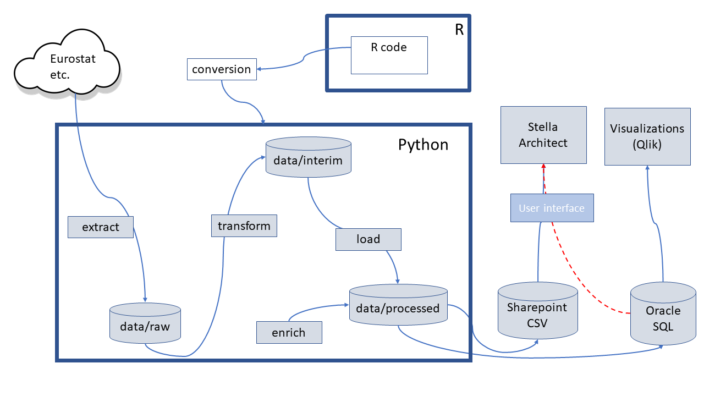
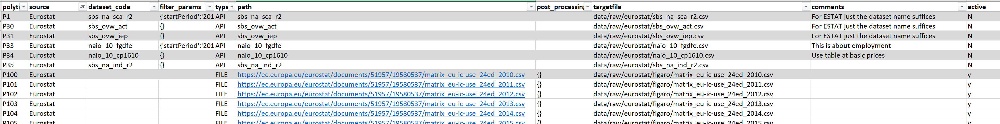
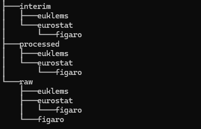
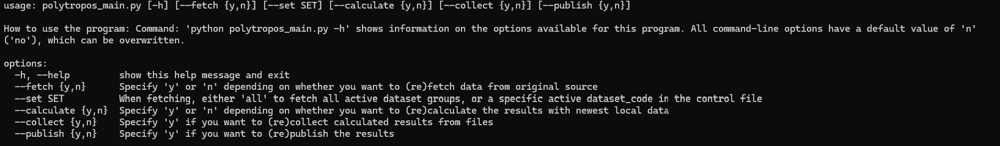
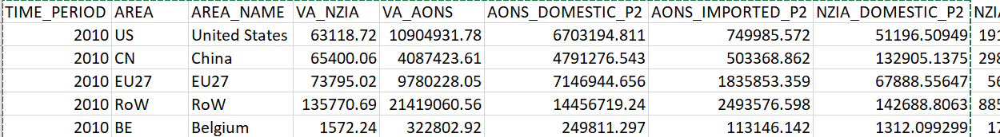
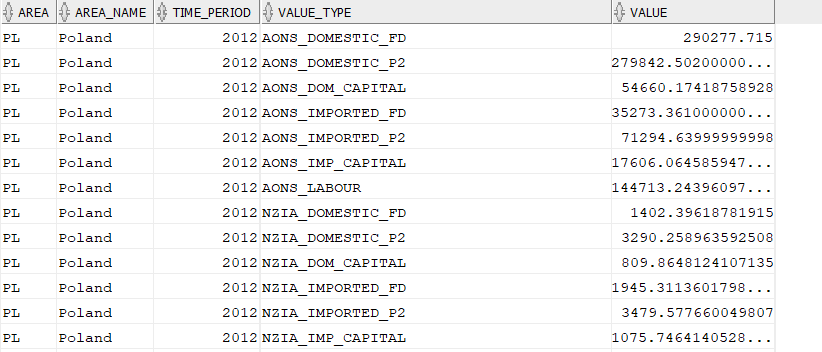

# Polytropos Data Workbench
## Programs to extract, transform and load (ETL) data relevant to Polytropos project
Last update: 24.10.2025

## Introduction
This Python application implements the ETL (extract, transform and load) functionalities for POLYTRoPOS needs.

The source code is kept in the EC Git (https://citnet.tech.ec.europa.eu/CITnet/stash/scm/rio/polytropos.git).

### Prerequisites
#### Python
The first prerequisite for running this program is Python. It is advisable to use version 3.12 or newer.

#### Other Prerequisites
Various Python packages are needed to run the program. A good practice is to create a virtual environment for this program to not interfere with possible other Python programs on the computer. See instructions below. 
Libraries used by this program are listed in the "requirements.txt" file and can be installed via pip.

### Installation
* Install Python
* Unzip/clone the application to your desired folder (project folder). Move to project folder. 
* Create a virtual environment: **python -m venv venv** (this creates a folder "venv" in the project folder and a Python virtual environment)
* Activate the venv: **venv\Scripts\activate.bat** (to activate the virtual environment)
* Install required Python packages in the virtual environment: **pip install -r requirements.txt** (this takes several minutes to run)

NOTE: you may need to specify the proxy information depending on your network configuration: pip install -r requirements.txt --proxy http://<username>:<pw>@<proxy_server>:<proxy_port> 

NOTE: the installation only affects the project folder and therefore uninstallation is done simply by deleting the whole folder.

### Program components
The program consists of Python classes (e.g. class Get_Data in polytropos_fetch_data.py). See below.

The classes use a special **control file** (polytropos_control.xlsx), which defines all data sets to be retrieved and where they will be stored.

The folder structure to store the files during the ETL processing is kept in the "data" folder and looks like this:

where the
- raw contains **original files from sources**
- interim contains **files under transformations, merging, enriching etc**
- processed contains **final files to be published**

#### Python files
- **config_polytropos.py**  
General self-explanatory settings for the entire program. 

- **polytropos_common.py**  
Contains common definitions and methods for all other Python classes to make their maintenence easy. For example there are methods to work with files.

- **polytropos_main.py**  
Main program and user interface to run the program or various parts of it. For example:  
1. python polytropos_main.py --help  
Shows the options of the user interface:  
  
2. python polytropos_main.py --fetch=y --calculate=y  
Runs the data retrieval for active data sets and (re)calculates indicator values for those. The results are stored locally and not published.  
3. python polytropos_main.py --collect=y  
Collects active individual result files into a merged result file. The results are stored locally and not published.  
4. python polytropos_main.py --publish=y  
Publishes merged results to Sharepoint and Oracle database.  
5. python polytropos_main.py --fetch=y --calculate=y --collect=y--publish=y  
Runs the entire processing pipeline for active data sets  

- **polytropos_fetch_data.py**  
Contains methods for accessing different data sets from various sources (e.g. Eurostat, EU-Klems) in various formats (e.g. API, file share, zip file) and storing them locally in the RAW folder.  

- **polytropos_calculator.py**  
Implements the calculations of indicator groups (e.g. Value-added supply) which may contain one or more indicators. Each indicator group has its dedicated Python class, which is based on the original R script. Currently they are:
1. **value_added_supply.py**  
Uses Figaro's matrix_eu-ic-use_24ed_*.csv files for rows "W2_D1", "W2_D29X39", "W2_B2A3G".  
2. **value_added_demand.py**  
Uses Figaro's flatfile_eu-ic-io_ind-by-ind_24ed_*.csv files for demand codes "P3_S13", "P3_S14", "P3_S15", "P51G", "P5M".  
3. **labour_d1.py**  
Uses Figaro's flatfile_eu-ic-io_ind-by-ind_24ed_*.csv files.  
4. **capital_p51g.py**  
Uses Figaro's flatfile_eu-ic-io_ind-by-ind_24ed_*.csv files.

- **polytropos_collector.py**  
Collects and converts all individual calculation results into a standardised structure file and eventually a merged data set of all results in the PROCESSED folder. 

The structure of the merged file is below ("wide", panel format with all indicator values on a single row). 

- **polytropos_publisher.py**  
Publishes the merged data set containing all calculated indicator values to pre-defined environments for end users. Currently publishing is possible to Sharepoint (via OneDrive), Oracle, and JRC Delta environment.  

When publishing to files, the above merged structure is used. When publishing to Oracle both the merged structure and a more "processing-friendly", long structure with one value on each row, are produced. Example below:

In addition there are some helper programs, like:
- polytropos_test.py (in folder "tests") to create an Excel file of **differences** in percentage of selected 40 indicator values for the above 4 calculators. Reference values are picked randomly from the results produced by R scripts.

